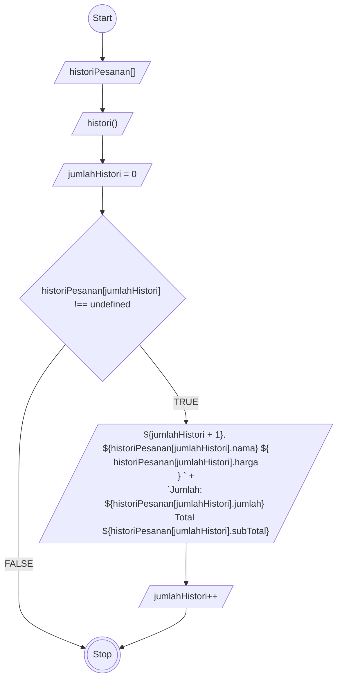

# Flowchart Histori Makanan

```mermaid
    flowchart TD

START@{shape: circ, label: "Start"}
STOP@{shape: dbl-circ, label: "Stop"}

HISTORIPESANAN@{shape: lean-r, label: "historiPesanan[]"}

FUNCHISTORI@{shape: lean-r, label: "histori()"}
JUMLAHHISTORI@{shape: lean-r, label: "jumlahHistori = 0"}

DECISIONHISTORIPESANAN@{shape: diam, label: "historiPesanan[jumlahHistori] !== undefined"}

LOG@{shape: lean-r, label: "${jumlahHistori + 1}. ${historiPesanan[jumlahHistori].nama} ${
        historiPesanan[jumlahHistori].harga
      } ` +
        `Jumlah: ${historiPesanan[jumlahHistori].jumlah} Total ${historiPesanan[jumlahHistori].subTotal}"}

JUMLAHHISTORIPLUS@{shape: lean-r, label: "jumlahHistori++"}

START-->HISTORIPESANAN
HISTORIPESANAN-->FUNCHISTORI
FUNCHISTORI-->JUMLAHHISTORI
JUMLAHHISTORI-->DECISIONHISTORIPESANAN

DECISIONHISTORIPESANAN--TRUE-->LOG
DECISIONHISTORIPESANAN--FALSE-->STOP


LOG-->JUMLAHHISTORIPLUS
JUMLAHHISTORIPLUS-->STOP


```