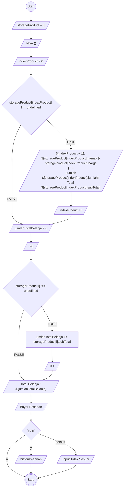

# Flowchart Keranjang Makanan 

```mermaid
flowchart TD

START@{shape: circ, label: "Start"}
STOP@{shape: dbl-circ, label: "Stop"}

STORAGEPRODUCT@{shape: lean-r, label: "storageProduct = []"}
FUNCBAYAR@{shape: lean-r, label: "bayar()"}

INDEXPRODUCT@{shape: lean-r, label: "indexProduct = 0"}

DECISIONINDEXPRODUCT@{shape: diam, label: "storageProduct[indexProduct] !== undefined"}

LOGINDEXPRODUCT@{shape: lean-r, label: "${indexProduct + 1}. ${storageProduct[indexProduct].nama} ${
        storageProduct[indexProduct].harga
      } ` +
        `Jumlah ${storageProduct[indexProduct].jumlah} Total ${storageProduct[indexProduct].subTotal}"}

INDEXPRODUCTPLUS@{shape: lean-r, label: "indexProduct++"}

JUMLAHTOTALBELANJA@{shape: lean-r, label: "jumlahTotalBelanja = 0"}
i@{shape: lean-r, label: "i=0"}

DECISIONSTORAGEPRUDUCT@{shape: diam, label: "storageProduct[i] !== undefined"}

PROSESJUMLAHTOTALBELANJA@{shape: rect, label: "jumlahTotalBelanja += storageProduct[i].subTotal"}

iPLUS@{shape: lean-r, label: "i++"}

LOGTOTALBELANJA@{shape: lean-r, label: "Total Belanja : ${jumlahTotalBelanja}"}


START-->STORAGEPRODUCT
STORAGEPRODUCT-->FUNCBAYAR 
FUNCBAYAR-->INDEXPRODUCT

INDEXPRODUCT-->DECISIONINDEXPRODUCT
DECISIONINDEXPRODUCT--TRUE-->LOGINDEXPRODUCT
DECISIONINDEXPRODUCT--FALSE-->JUMLAHTOTALBELANJA

BAYARPESANAN@{shape: lean-r, label: "Bayar Pesanan"}

DECISIONY@{shape: diam, label: ' "y / n" '}
HISTORIPESANAN@{shape: lean-r, label: "historiPesanan"}

DEFAULT@{shape: lean-r, label: "Input Tidak Sesuai"}


LOGINDEXPRODUCT-->
INDEXPRODUCTPLUS-->JUMLAHTOTALBELANJA
JUMLAHTOTALBELANJA-->i

i-->DECISIONSTORAGEPRUDUCT
DECISIONSTORAGEPRUDUCT--TRUE-->PROSESJUMLAHTOTALBELANJA
DECISIONSTORAGEPRUDUCT--FALSE-->LOGTOTALBELANJA


PROSESJUMLAHTOTALBELANJA-->iPLUS
iPLUS-->LOGTOTALBELANJA

LOGTOTALBELANJA-->BAYARPESANAN

BAYARPESANAN-->DECISIONY
DECISIONY--y-->HISTORIPESANAN
DECISIONY--n-->STOP
DECISIONY--default-->DEFAULT

HISTORIPESANAN-->STOP
DEFAULT-->STOP


```