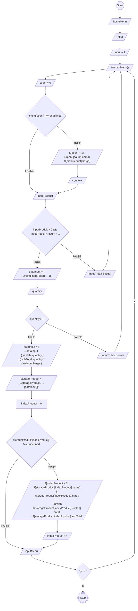

# Flowchart Pesan Makanan

```mermaid
flowchart TD

START@{shape: circ, label: "Start"}
STOP@{shape: dbl-circ, label: "Stop"}

HOMEMENU@{shape: lean-r, label: "homeMenu"}
INPUT@{shape: lean-r, label: "input"}
INPUT1@{shape: lean-r, label: "input = 1"}
TAMBAHMENU@{shape: lean-r, label: "tambahMenu()"}
COUNT@{shape: lean-r, label: "count = 0"}
MENUCOUNT@{shape: diam, label: "menu[count] !== undefined"}
LOGCOUNT@{shape: lean-r, label: "${count + 1}. ${menu[count].nama} ${menu[count].harga}"}

COUNTPLUS@{shape: lean-r, label: "count++"}
INPUTPRODUCK@{shape: lean-r, label: "inputProduct"}

DECISIONINPUTPRODUCK@{shape: diam, label: "inputProduk > 0 && inputProduk < count + 1"}

DATAINPUT@{shape: lean-r, label: "dataInput = { ...menu[inputProduk - 1] }"}

QUANTITY@{shape: lean-r, label: "quantity"}
DECISIONQUANTITY@{shape: diam, label: "quantity > 0"}

DATAINPUT2@{shape: lean-r, label: "dataInput = {
            ...dataInput,
            ...{ jumlah: quantity },
            ...{ subTotal: quantity * dataInput.harga }" } 

STORAGEPRODUCT@{shape: lean-r, label: "storageProduct = [...storageProduct, ...[dataInput]];"}

INDEXPRODUCT@{shape:lean-r, label: "indexProduct = 0"}

DECISIONINDEXPRODUCT@{shape: diam, label: "storageProduct[indexProduct] !== undefined"}

LOGINDEXPRODUCT@{shape: lean-r, label: "${indexProduct + 1}. ${storageProduct[indexProduct].nama} ${
                storageProduct[indexProduct].harga
              } ` +
                `Jumlah ${storageProduct[indexProduct].jumlah} Total ${storageProduct[indexProduct].subTotal"}

INDEXPRODUCTPLUS@{shape: lean-r, label: "indexProduct ++"}

INPUTMENU@{shape: lean-r, label: "inputMenu"}

DECISIONINPUTMENU@{shape: diam, label: '"y / n"'}

TIDAKVALID@{shape: lean-r, label: "Input Tidak Sesuai"}
TIDAKVALID2@{shape: lean-r, label: "Input Tidak Sesuai"}


START-->HOMEMENU
HOMEMENU-->INPUT
INPUT-->INPUT1
INPUT1-->TAMBAHMENU
TAMBAHMENU-->COUNT

COUNT-->MENUCOUNT
MENUCOUNT--TRUE-->LOGCOUNT
MENUCOUNT--FALSE-->INPUTPRODUCK

LOGCOUNT-->COUNTPLUS
COUNTPLUS-->INPUTPRODUCK

INPUTPRODUCK-->DECISIONINPUTPRODUCK
DECISIONINPUTPRODUCK--TRUE-->DATAINPUT
DECISIONINPUTPRODUCK--FALSE-->TIDAKVALID2
TIDAKVALID2-->TAMBAHMENU


DATAINPUT-->QUANTITY
QUANTITY-->DECISIONQUANTITY

DECISIONQUANTITY--TRUE-->DATAINPUT2
DECISIONQUANTITY--FALSE-->TIDAKVALID
TIDAKVALID-->TAMBAHMENU

DATAINPUT2-->STORAGEPRODUCT
STORAGEPRODUCT-->INDEXPRODUCT

INDEXPRODUCT-->DECISIONINDEXPRODUCT

DECISIONINDEXPRODUCT--TRUE-->LOGINDEXPRODUCT
DECISIONINDEXPRODUCT--FALSE-->INPUTMENU

LOGINDEXPRODUCT-->INDEXPRODUCTPLUS
INDEXPRODUCTPLUS-->INPUTMENU

INPUTMENU-->DECISIONINPUTMENU

DECISIONINPUTMENU--y-->TAMBAHMENU
DECISIONINPUTMENU--n-->STOP


```